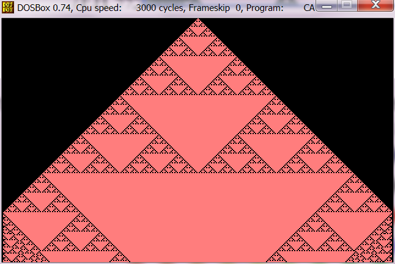
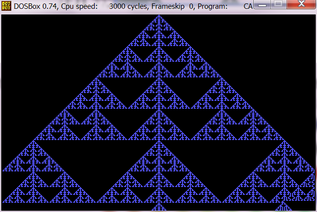
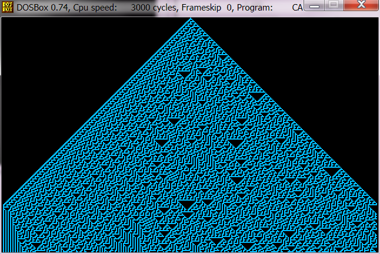
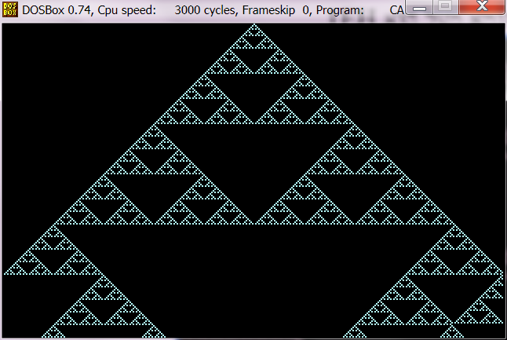
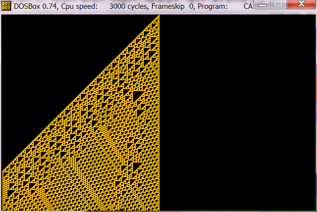
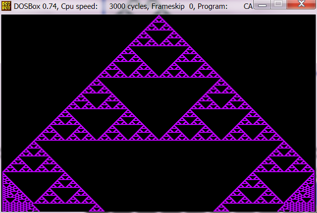

# CellularAutomata-2008

This is my Cellular Automata project from high-school. No particular reason to upload it other than wanting to make sure I have a proper backup.

The project is a basic 1D-CA, with a single cell seed, written in 16bit x86 assembly.

The project is built using TASM.

## Sample Rules

### 0xB6

### 0x96

### 0x1E

### 0x5A

### 0x6E

### 0x7E

